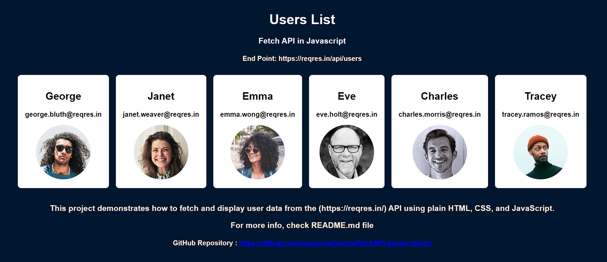

# 🎉 ReqRes Users Fetch Example 🎉

This project demonstrates how to fetch and display user data from the [ReqRes](https://reqres.in/) API using plain HTML, CSS, and JavaScript.

## Output

 
[image](./output.png)

## 📋 Table of Contents

- [Introduction](#introduction)
- [Features](#features)
- [Technologies](#technologies)
- [Setup](#setup)
- [Usage](#usage)
- [Explanation](#Explanation)
- [Overview](#Overview)

## 🌟 Introduction

This project is a simple web page that fetches user data from the ReqRes API and displays it in a dynamic and visually appealing manner. The user data is displayed in cards with each user's name, email, and avatar.

## ✨Features

- Fetches user data from ReqRes API
- Displays user data in responsive cards
- Dynamic CSS effects for better user experience

## 🛠️ Technologies

- HTML
- CSS
- JavaScript

## ⚙️ Setup

1. Clone the repository or download the files.
2. Ensure all files (`index.html`, `styles.css`, `main.js`) are in the same directory.
3. Open `index.html` in your web browser to view the project.

## 🚀 Usage

1. Open the `index.html` file in a web browser.
2. The page will automatically fetch and display users from the ReqRes API.
3. Hover over the user cards to see the dynamic effects.

## 📲 Explanation

1. HTML Structure:

- ✔️The HTML structure includes a div with the class App which contains an h1 and another div with the class flex and ID user-container.
- ✔️ This user-container is where user data will be dynamically inserted.

2. CSS Styling:

- ✔️ The CSS file styles the container, flexbox layout, individual user divs, and images. It ensures that the user information is presented in a clean, organized manner.

3. JavaScript:

- ✔️ The JavaScript file handles fetching user data from the API and displaying it on the webpage.
  fetchUsers is an asynchronous function that fetches user data from the API, parses the JSON response, and calls displayUsers to update the DOM.
- ✔️ displayUsers iterates over the user data, creating and appending elements for each user's name, email, and avatar to the user-container.
- ✔️ The DOMContentLoaded event ensures that the JavaScript runs after the HTML content has been loaded.

## 🔦 Overview

1. The `index.html` file sets up the basic structure of the web page, including links to the CSS and JavaScript files.
2. The `styles.css` file contains styles to enhance the visual appearance of the web page, including background colors, flexbox layout, and hover effects.
3. The `main.js` file contains JavaScript code to fetch user data from the ReqRes API and dynamically insert it into the HTML.
